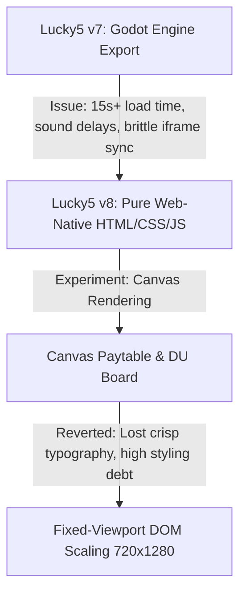

# Lucky5 v8: Comprehensive Development History, Architectural Decisions, and Technical State

Welcome, Agent! This document is the definitive, fully curated global onboarding manual for the Lucky5 v8 project. It captures the complete development history, strategic pivots, design philosophies, past technical failures, key achievements, and the current software state.

Read this document carefully before writing any code or proposing modifications. It preserves the hard-won lessons from multiple generations of development.

---

## 1. Project Overview & Core Philosophy

Lucky5 v8 is a modern digital recreation of a classic **1990s Lebanese Bonanza-style arcade video poker cabinet**. The application consists of a high-performance **.NET 10 API and Realtime SignalR server** and a **pure web-native HTML5/CSS3/Vanilla JS cabinet client** served directly by ASP.NET.

### The Identity Rule: Do Not Modernize
The core product value lies in its **absolute retro physical cabinet feel**. You must reject any temptation to modernize the UI. 

```
  Lebanese Arcade Aesthetic (ai9poker.com)
  ┌────────────────────────────────────────────────────────┐
  │ [Retro CRT Glow Screen]                                │
  │ - Green pixel-font CREDIT, Yellow STAKE                │
  │ - Rainbow pixel paytable (Royal Flush to 2 Pair)       │
  │ - 5 Large procedural DOM cards (Ivory + Gold borders)  │
  │ - Kent & Serie progressive counters                    │
  │ - Always-visible progressive jackpot pools             │
  ├────────────────────────────────────────────────────────┤
  │ [Warm Brown Wooden Control Deck]                       │
  │ - 3D-beveled, physically-modeled tactile buttons       │
  │ - GREEN for Bet, RED for Deal Draw (Lebanese reverse)  │
  └────────────────────────────────────────────────────────┘
```

#### Core Design Principles
*   **Mechanical, Not Cinematic:** No particle effects, no camera shakes, no vector-graphics coin showers. Card reveal and counter increments must mimic physical mechanical relays.
*   **Deliberate Pacing:** Cards drop one-by-one. Winnings drain from the paytable row into the CREDIT meter slowly enough to feel like an achievement.
*   **Two Separate Currency Tracks:**
    *   **Wallet Balance:** The player's overall account balance. It is *only* visible in the menu/lobby and is never displayed on the cabinet screen.
    *   **Machine Credits (CREDIT):** The virtual "chips" loaded into the machine. This is the *only* value displayed on the cabinet screen and used for betting/payouts.

---

## 2. History of Development & Strategic Pivots



### Pivot 1: Dropping the Godot/Next.js Iframe (The v7 to v8 Pivot)
*   **The v7 Architecture:** The cabinet interface was built in the Godot Game Engine, exported to WebGL, and embedded inside a Next.js hosted web wrapper via an iframe.
*   **The Failure Modes:**
    1.  **Massive Startup Latency:** Loading the Godot WebGL bundle took upwards of 15 seconds, leading to immediate player bounce.
    2.  **Audio Latency:** Sound effects (crucial for retro physical feel) were delayed by up to 500ms due to browser audio context limitations inside the nested iframe.
    3.  **Brittle State Recovery:** When players disconnected on mobile or refreshed the page, restoring the precise state (mid-Double-Up or mid-siphon) through the iframe boundary was highly error-prone.
*   **The v8 Decision:** Drop Godot and Next.js. Rebuild the cabinet using pure, native **HTML5, CSS3, and Vanilla JavaScript** directly inside the ASP.NET static host (`wwwroot`). This reduced loading time to under 1 second, achieved near-zero audio latency, and simplified state serialization.

### Pivot 2: The Canvas Renderer Experiment (Abandoned)
*   **The Attempt:** In an early v8 branch, an agent tried to rewrite the Paytable and Double-Up board using HTML5 `<canvas>` elements (`paytable-canvas.js` and `du-board-canvas.js`) to mimic Flutter's CanvasKit.
*   **The Failure Modes:**
    1.  **Crispness Loss:** Text rendering inside canvas suffered from high-DPI blurriness on mobile screens.
    2.  **Excessive Technical Debt:** Writing manual canvas drawing routines (`ctx.fillText`, manual bounding box checks) made layouts extremely rigid and difficult to style or animate.
*   **The Solution:** The canvas approach was completely **abandoned and reverted** in favor of **Fixed-Viewport DOM Scaling**. This keeps the standard DOM elements (allowing responsive, crisp typography and pure CSS styling) while scaling the parent container uniformly.

---

## 3. Notable Technical Achievements

### 1. Unified Fixed-Viewport Architecture
Older revisions used container queries (`cqw`/`cqh`) which caused rounding errors, causing the top edge of the cabinet to be cut off on standard 1080p and ultrawide screens.
*   **The Fix:** Centralized the coordinate space in `#cabinet-viewport` sized at a fixed logical resolution of `720x1280` with `transform-origin: center center`.
*   **The Scaling Logic:**
    ```javascript
    function scaleCabinet() {
        const viewport = document.getElementById('cabinet-viewport');
        const parent = document.getElementById('game-container');
        const scaleX = parent.clientWidth / 720;
        const scaleY = parent.clientHeight / 1280;
        const scale = Math.min(scaleX, scaleY, 1); // Clamp to max 1x
        viewport.style.transform = `scale(${scale})`;
    }
    ```
    This guarantees that the entire cabinet remains perfectly centered and visible on any display aspect ratio.

### 2. 100% DOM-Procedural Card Assets
To prevent scaling pixelation and network loading delays, all card assets are rendered procedurally using clean CSS variables and HTML unicode glyphs:
```css
.card {
    background: #fdfdfd; /* Ivory */
    border: 3px solid #d4af37; /* Gold Inner Border */
    border-radius: 8px;
    box-shadow: inset 0 0 10px rgba(0,0,0,0.15);
}
```
*No external card PNG files are loaded.*

### 3. Pure CSS 3D-Beveled Buttons
Replaced missing/broken decompiled button PNGs with a robust, realistic 3D bevel effect using pure CSS gradients and multiple `box-shadow` layers:
```css
.cab-btn {
    background: linear-gradient(180deg, var(--btn-light) 0%, var(--btn-dark) 100%);
    box-shadow: 
        0 4px 0 var(--btn-shadow), /* 3D Side depth */
        0 8px 16px rgba(0, 0, 0, 0.4); /* Floor drop shadow */
    border: 1px solid rgba(255, 255, 255, 0.2);
}
.cab-btn:active {
    transform: translateY(4px);
    box-shadow: 0 0px 0 var(--btn-shadow), 0 4px 8px rgba(0, 0, 0, 0.4);
}
```

### 4. Sequential Pacing and Animation Sync
Replaced brittle global `setTimeout` offsets with clean, chained callback-based timing. This prevents state-machine synchronization failures when frame rates stutter:
*   **Base Deal Stagger:** `180ms` per card sequential drop (Slot 1 → Slot 5).
*   **Draw Reveal Stagger:** `100ms` sequential flip for replaced cards.
*   **Visual DU Shuffle:** `130ms` per card-face cycle to create a realistic physical reel-spin effect before stopping deterministically on the server's seed-generated `Noise` card.

---

## 4. Historical Mistakes & Preventative Lessons

> [!WARNING]
> ### 1. Timer-Based State Synchronization (The Brittle Timing Bug)
> **Mistake:** Previous agents triggered game state transitions (e.g., from `dealing` to `dealt`) using hardcoded, concurrent `setTimeout` timers. If the browser dropped frames during dealing, the UI enabled buttons *before* cards finished drawing, leading to severe state-machine desyncs.
> **Prevention:** **Never** use raw, un-sequenced timers to transition game state. Always hook transitions to animation-complete events or chain them using Promise-based sequences.

> [!CAUTION]
> ### 2. Siphon Credit Drain Bug (The Double-Up Theft)
> **Mistake:** In the Double-Up loss handler, `animateReverseDrain` incorrectly subtracted the lost `winAmount` from the player's base `balance` (the CREDIT meter). Losing a Double-Up round should only zero out the virtual WIN display; it must *never* deduct from the player's base credited wallet.
> **Prevention:** Keep the player base credits meter (`MachineCredits` / `balance`) completely stable during a Double-Up loss. Only drain the WIN meter.

---

## 5. Comprehensive Technical State of Game Modules

The code is strictly divided into an **authoritative backend** and a **presentation-only frontend**.

```
  ┌─────────────────────────────────────────┐
  │               .NET 10 API               │
  │     (Game State & Rules Authority)      │
  └────────────────────┬────────────────────┘
                       │
             SignalR JSON DTO state
                       │
  ┌────────────────────▼────────────────────┐
  │          Pure Web-Native Client         │
  │    (Presentation, Sound, Animations)    │
  └─────────────────────────────────────────┘
```

### Backend (Server Architecture)
*   **Authority Boundary:** `server/src/Lucky5.Domain/Game/CleanRoom/`
    *   `CoreModels.cs`: Defines paytable payout profiles, jackpot structures, and categories.
    *   `FiveCardDrawEngine.cs`: Evaluates hands, handles Deal/Draw stages, and detects sequential straight Kents.
    *   `Lucky5DoubleUpEngine.cs`: Manages 5-card progressive Double-Up state, dealer card swaps, and 5♠ "never-lose" checks.
*   **Realtime Signaling:** Hubs transmit comprehensive state DTOs on every player interaction over SignalR. No state calculation is done client-side.

### Frontend (Client Architecture)
Located in `server/src/Lucky5.Api/wwwroot/`:
*   `index.html`: The HTML cabinet viewport structure, layout layers, and control deck.
*   `js/game-config.js`: Centralized timing config (`dealStaggerMs: 180`, `drawStaggerMs: 100`, etc.) and flash durations.
*   `js/game.js`: The core SignalR client, event routing, win-drain timing, and Double-Up state handlers.
*   `js/cabinet-stage-vnext.js`: The presentation layer managing DOM card rendering, button state highlights, and transition choreography.
*   `css/cabinet-v8-quality.css`: Core aesthetic styling, gradients, and custom pixel typography.

---

## 6. Mathematical Invariants, Multipliers, & Jackpots

### Payout Multipliers (Lebanese Paytable Profile)
The paytable scale behaves as a fixed reference. Hand values scale linearly with `STAKE`.

| Hand Category | Multiplier | Pay at 5,000 Stake | Row Color (Top-Down) |
| :--- | :--- | :--- | :--- |
| **Royal Flush** | `1000×` | 5,000,000 | Red/White Glow |
| **Straight Flush** | `300×` | 1,500,000 | Red |
| **Four of a Kind** | `120×` | 600,000 | Cyan |
| **Full House (Ranked)** | `20×` | 100,000 | Yellow (Armed rank highlighted) |
| **Flush** | `14×` | 70,000 | Red |
| **Straight** | `10×` | 50,000 | Green |
| **Three of a Kind** | `6×` | 30,000 | Cyan |
| **Two Pair** | `4×` | 20,000 | Yellow |

*Note: One-Pair and Jacks-or-Better do not pay in Lucky5. The minimum paying hand is 2 Pair.*

### The Progressive Jackpot System

```
  ┌────────────────────────────────────────────────────────────────────────┐
  │                   Active Progressive Jackpots                          │
  ├──────────────────────┬────────────────────────┬────────────────────────┤
  │ Full House (Ranked)  │ Four of a Kind (A & B) │ Straight Flush / Kent  │
  │ - Starting: 90,000   │ - Starting: 140,000    │ - Starting: 850,000    │
  │ - Cap: 650,000       │ - Cap: 1,000,000       │ - Cap: 7,500,000       │
  └──────────────────────┴────────────────────────┴────────────────────────┘
```

1.  **Rotating Full House Jackpot:**
    *   Displays the currently "armed" Full House rank card (e.g. King) in the middle slot (index 2) when the machine is idle.
    *   Players can manually switch the armed rank pre-deal using the top-left `HOLD[0]` button (only available if `BET` was pressed at least once in the current session).
2.  **Kent Counter (`KENT /3`):**
    *   Triggers when the initial dealt 5 cards form a sequential straight (either ascending positional order `2,3,4,5,6` or descending positional order `6,5,4,3,2` left-to-right).
    *   The `KENT /3` streak counter persists across non-Kent rounds and resets to `0` only when hitting the 3rd Kent (paying out the progressive Kent jackpot).
3.  **The 40M Credit Close Threshold:**
    *   Once a machine's credit display (`MachineCredits`) reaches or exceeds **40,000,000 credits**, the machine transitions to the **MACHINE CLOSED** state.
    *   All play actions (`BET`, `DEAL`, `DOUBLE UP`) freeze.
    *   The **Auto-Siphon** triggers immediately, draining all excess credits directly into the player's primary account Wallet, then resets the cabinet session.

---

## 7. Double-Up Mode: Advanced Mechanics

### 1. The 5-Card Progressive Board
Unlike basic Hi-Lo coin flips, the Double-Up is a 5-card progressive board. Cards accumulate left-to-right as the player guesses successfully. Forming a **Four of a Kind** on the Double-Up board awards the base 4OAK paytable bonus *in addition to* the doubled stake!

### 2. The 5♠ Never-Lose Rule
When `IsNoLoseActive` is `true`, landing the **5 of Spades** as the challenger card protects the player's winnings from forfeiture on a wrong guess. This triggers exactly **one visual effect**: a **1-second full-screen soothing white flash** (`.lucky5-active` utility styled for `1000ms`), resolving the guess safely as `SafeFail` and returning the accumulated stake.

---

## 8. Actionable Guidelines for Coding Agents

*   **Rule 1: Always Ground via `comp/run_pipeline` First:** Do not guess the file structure. Before making any frontend/backend changes, use the vexp pipeline to query files.
*   **Rule 2: Respect the Authority Boundary:** Never write client-side logic to determine card outcomes, payouts, or ledger updates. The frontend must only interpret and present the backend SignalR state payloads.
*   **Rule 3: Keep HTML Elements and CSS Variables Crisp:** Do not reintroduce canvas components for the main UI. Rely on clean HTML5 semantic elements scaled uniformly inside `#cabinet-viewport`.
*   **Rule 4: Preserve the Core Aesthetic:** Do not introduce modern smooth transitions, drop-shadows, or modern rounded web components on the cabinet face. Every visual change must respect the 90s CRT and wooden arcade boundaries.
